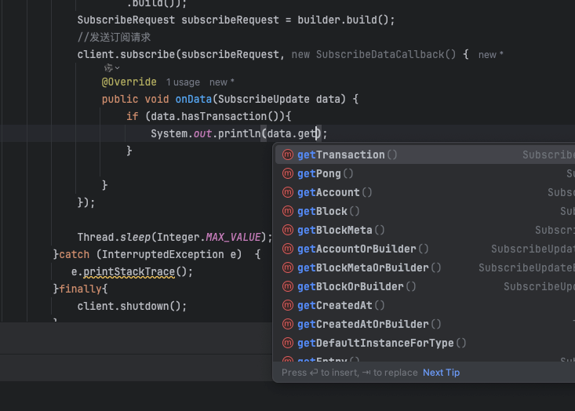

# 订阅pump交易数据并解析

###  1.创建订阅客户端
```java
SubscriptionClient client = new SubscriptionClient("test-grpc.chainbuff.com:443");
```

### 2.构建订阅请求
```java
  SubscribeRequest.Builder builder = SubscribeRequest.newBuilder();
            builder.setCommitment(CommitmentLevel.CONFIRMED);
            builder.putTransactions("transactions_sub",
                    SubscribeRequestFilterTransactions.newBuilder()
                    .addAccountInclude("6EF8rrecthR5Dkzon8Nwu78hRvfCKubJ14M5uBEwF6P")// 监听pump交易
                    .build());
            SubscribeRequest subscribeRequest = builder.build();
```
### 3.发送订阅请求
#### SubscribeDataCallback 是一个回调接口，用于接收订阅数据
#### SubscribeUpdate 是返回订阅数据对象，可以直接从对象里获取数据

```java
    client.subscribe(subscribeRequest, new SubscribeDataCallback() {
                @Override
                public void onData(SubscribeUpdate data) {
                    System.out.println(data);
                }
            });
```

### 4.返回数据
```javascript
transaction {
    transaction {
        signature: "\271m0Q\236v\301\271w\320\231\n\325G\034`\366\2636\306<`\320&\375\001{5\226\200\016\377a\3307N\233%\314\016C-4\214\366\334m\323l~\370\230iG\224\201\346\204\214\357\362\\\307\004"
        transaction {
            signatures: "\271m0Q\236v\301\271w\320\231\n\325G\034`\366\2636\306<`\320&\375\001{5\226\200\016\377a\3307N\233%\314\016C-4\214\366\334m\323l~\370\230iG\224\201\346\204\214\357\362\\\307\004"
            signatures: "re\273\364y\211*\025\200\030C\317%\306E}0uo`I\306\3530t\307o\v}\036\323\301\221\277\341\025\352\232\"\033\023.\310\276\231\361(=\037\006\337\177\034}\036O\335\230\255Y6\244\220\b"
            message {
                header {
                    num_required_signatures: 2
                    num_readonly_unsigned_accounts: 4
                }
                account_keys: "e`\2574\311\201\267\032u\256\033#\350\001\324>\321\307\3529/\236,5_\274!\035\362\202cs"
                account_keys: "\374\307\216\223 \303\212\215\fs\231\340\'\313I\325\027\245*!n\355p\30092\305nK\034\250X"
                account_keys: "l\027{\270:\337\303Ff\214\2465K\246\310m\2732\314Mn_86\235\217\b\245+\032\252\n"
                account_keys: "\266\355\333\311\324\260\203%K\223f\313d\020\263\262\246Z#A\0334\030\256\374\330\020G\341\025Bc"
                account_keys: "\274\024A\373\337\300\350\206/<\002\222\3500\2546\200\274\262\264\"\246\303@\334\302\216\335\203\300\272\224"
                account_keys: "\266\276j\225\217\346\2073\211\022)cE\\\223N\221\353\261b\276\024[\360;O\311\005.\376v\025"
                account_keys: "\034\240\324E\355u\243\031\247ud\275\230\302\276\330\3048\211~\037\323\243\3717%q.\323\334\264\252"
                account_keys: "\003\006Fo\345!\0272\377\354\255\272r\303\233\347\274\214\345\273\305\367\022k,C\233:@\000\000\000"
                account_keys: "\000\000\000\000\000\000\000\000\000\000\000\000\000\000\000\000\000\000\000\000\000\000\000\000\000\000\000\000\000\000\000\000"
                account_keys: "\006\335\366\341\327e\241\223\331\313\341F\316\353y\254\034\264\205\355_[7\221:\214\365\205~\377\000\251"
                account_keys: "K\331I\3046\002\303? w\220\355\026\243RL\241\271\227\\\361!\242\251\f\377\354}\370\266\212\315"
                recent_blockhash: "\246\a\av\303+\377\360\260\246\212\230m\257\a\f2\315\265\274\016x\223L>\332\207k~z\357\351"
                instructions {
                    program_id_index: 7
                    data: "\003\270@\371\003\000\000\000\000"
                }
                instructions {
                    program_id_index: 7
                    data: "\002\370$\001\000"
                }
                instructions {
                    program_id_index: 8
                    accounts: "\000\001"
                    data: "\000\000\000\000\240\273\r\000\000\000\000\000\000\000\000\000\000\000\000\000\000\000\000\000\000\000\000\000\000\000\000\000\000\000\000\000\000\000\000\000\000\000\000\000\000\000\000\000\000\000\000\000"
                }
                instructions {
                    program_id_index: 8
                    accounts: "\000\002"
                    data: "\003\000\000\000e`\2574\311\201\267\032u\256\033#\350\001\324>\321\307\3529/\236,5_\274!\035\362\202cs \000\000\000\000\000\000\00041699bf9284d6a0f83b6a0df0ccb4dcb\360\035\037\000\000\000\000\000\245\000\000\000\000\000\000\000\006\335\366\341\327e\241\223\331\313\341F\316\353y\254\034\264\205\355_[7\221:\214\365\205~\377\000\251"
                }
                instructions {
                    program_id_index: 9
                    accounts: "\002\v\000\f"
                    data: "\001"
                }
                instructions {
                    program_id_index: 10
                    accounts: "\t\003\r\003\003\004\005\003\003\003\003\003\003\003\003\006\002\000"
                    data: "\t.\244\233\3747\002\000\000\000\000\000\000\000\000\000\000"
                }
                instructions {
                    program_id_index: 9
                    accounts: "\002\000\000"
                    data: "\t"
                }
                versioned: true
                address_table_lookups {
                    account_key: "\354Td\266mi\026T\\G\374\205\002\2124~_-\307\2613)\265\032\306\356\365>2\316\325Y"
                    readonly_indexes: "\020\002\016"
                }
            }
        }
        meta {
            fee: 5010001
            pre_balances: 135508551573
            pre_balances: 0
            pre_balances: 0
            pre_balances: 6124800
            pre_balances: 81575060110
            pre_balances: 2039280
            pre_balances: 2039280
            pre_balances: 1
            pre_balances: 1
            pre_balances: 934087680
            pre_balances: 1141440
            pre_balances: 778933627405
            pre_balances: 1009200
            pre_balances: 13822604201
            post_balances: 136480448148
            post_balances: 900000
            post_balances: 0
            post_balances: 6124800
            post_balances: 80597253534
            post_balances: 2039280
            post_balances: 2039280
            post_balances: 1
            post_balances: 1
            post_balances: 934087680
            post_balances: 1141440
            post_balances: 778933627405
            post_balances: 1009200
            post_balances: 13822604201
            inner_instructions {
                index: 5
                instructions {
                    program_id_index: 9
                    accounts: "\006\005\000"
                    data: "\003.\244\233\3747\002\000\000"
                    stack_height: 2
                }
                instructions {
                    program_id_index: 9
                    accounts: "\004\002\r"
                    data: "\003\360$H:\000\000\000\000"
                    stack_height: 2
                }
            }
            log_messages: "Program ComputeBudget111111111111111111111111111111 invoke [1]"
            log_messages: "Program ComputeBudget111111111111111111111111111111 success"
            log_messages: "Program ComputeBudget111111111111111111111111111111 invoke [1]"
            log_messages: "Program ComputeBudget111111111111111111111111111111 success"
            log_messages: "Program 11111111111111111111111111111111 invoke [1]"
            log_messages: "Program 11111111111111111111111111111111 success"
            log_messages: "Program 11111111111111111111111111111111 invoke [1]"
            log_messages: "Program 11111111111111111111111111111111 success"
            log_messages: "Program TokenkegQfeZyiNwAJbNbGKPFXCWuBvf9Ss623VQ5DA invoke [1]"
            log_messages: "Program log: Instruction: InitializeAccount"
            log_messages: "Program TokenkegQfeZyiNwAJbNbGKPFXCWuBvf9Ss623VQ5DA consumed 3443 of 74400 compute units"
            log_messages: "Program TokenkegQfeZyiNwAJbNbGKPFXCWuBvf9Ss623VQ5DA success"
            log_messages: "Program 675kPX9MHTjS2zt1qfr1NYHuzeLXfQM9H24wFSUt1Mp8 invoke [1]"
            log_messages: "Program log: ray_log: Ay6km/w3AgAAAAAAAAAAAAABAAAAAAAAAF1IN/lvBAAAnoQh/hIAAADdQ0f7arYAAPAkSDoAAAAA"
            log_messages: "Program TokenkegQfeZyiNwAJbNbGKPFXCWuBvf9Ss623VQ5DA invoke [2]"
            log_messages: "Program log: Instruction: Transfer"
            log_messages: "Program TokenkegQfeZyiNwAJbNbGKPFXCWuBvf9Ss623VQ5DA consumed 4645 of 53643 compute units"
            log_messages: "Program TokenkegQfeZyiNwAJbNbGKPFXCWuBvf9Ss623VQ5DA success"
            log_messages: "Program TokenkegQfeZyiNwAJbNbGKPFXCWuBvf9Ss623VQ5DA invoke [2]"
            log_messages: "Program log: Instruction: Transfer"
            log_messages: "Program TokenkegQfeZyiNwAJbNbGKPFXCWuBvf9Ss623VQ5DA consumed 4736 of 46017 compute units"
            log_messages: "Program TokenkegQfeZyiNwAJbNbGKPFXCWuBvf9Ss623VQ5DA success"
            log_messages: "Program 675kPX9MHTjS2zt1qfr1NYHuzeLXfQM9H24wFSUt1Mp8 consumed 30543 of 70957 compute units"
            log_messages: "Program 675kPX9MHTjS2zt1qfr1NYHuzeLXfQM9H24wFSUt1Mp8 success"
            log_messages: "Program TokenkegQfeZyiNwAJbNbGKPFXCWuBvf9Ss623VQ5DA invoke [1]"
            log_messages: "Program log: Instruction: CloseAccount"
            log_messages: "Program TokenkegQfeZyiNwAJbNbGKPFXCWuBvf9Ss623VQ5DA consumed 2915 of 40414 compute units"
            log_messages: "Program TokenkegQfeZyiNwAJbNbGKPFXCWuBvf9Ss623VQ5DA success"
            pre_token_balances {
                account_index: 4
                mint: "So11111111111111111111111111111111111111112"
                ui_token_amount {
                    ui_amount: 81.57302083
                    decimals: 9
                    amount: "81573020830"
                    ui_amount_string: "81.57302083"
                }
                owner: "5Q544fKrFoe6tsEbD7S8EmxGTJYAKtTVhAW5Q5pge4j1"
                program_id: "TokenkegQfeZyiNwAJbNbGKPFXCWuBvf9Ss623VQ5DA"
            }
            pre_token_balances {
                account_index: 5
                mint: "BF9f2bLRLof7c4V4HZW2UdDSeintuff1BQDrpMqzpump"
                ui_token_amount {
                    ui_amount: 2.00570598540253E8
                    decimals: 6
                    amount: "200570598540253"
                    ui_amount_string: "200570598.540253"
                }
                owner: "5Q544fKrFoe6tsEbD7S8EmxGTJYAKtTVhAW5Q5pge4j1"
                program_id: "TokenkegQfeZyiNwAJbNbGKPFXCWuBvf9Ss623VQ5DA"
            }
            pre_token_balances {
                account_index: 6
                mint: "BF9f2bLRLof7c4V4HZW2UdDSeintuff1BQDrpMqzpump"
                ui_token_amount {
                    ui_amount: 4878969.030749
                    decimals: 6
                    amount: "4878969030749"
                    ui_amount_string: "4878969.030749"
                }
                owner: "7pjgmWtxe5g8pDqsQ3UWmzHPaFbnMi9fPS76zugvQhvA"
                program_id: "TokenkegQfeZyiNwAJbNbGKPFXCWuBvf9Ss623VQ5DA"
            }
            post_token_balances {
                account_index: 4
                mint: "So11111111111111111111111111111111111111112"
                ui_token_amount {
                    ui_amount: 80.595214254
                    decimals: 9
                    amount: "80595214254"
                    ui_amount_string: "80.595214254"
                }
                owner: "5Q544fKrFoe6tsEbD7S8EmxGTJYAKtTVhAW5Q5pge4j1"
                program_id: "TokenkegQfeZyiNwAJbNbGKPFXCWuBvf9Ss623VQ5DA"
            }
            post_token_balances {
                account_index: 5
                mint: "BF9f2bLRLof7c4V4HZW2UdDSeintuff1BQDrpMqzpump"
                ui_token_amount {
                    ui_amount: 2.03010083055627E8
                    decimals: 6
                    amount: "203010083055627"
                    ui_amount_string: "203010083.055627"
                }
                owner: "5Q544fKrFoe6tsEbD7S8EmxGTJYAKtTVhAW5Q5pge4j1"
                program_id: "TokenkegQfeZyiNwAJbNbGKPFXCWuBvf9Ss623VQ5DA"
            }
            post_token_balances {
                account_index: 6
                mint: "BF9f2bLRLof7c4V4HZW2UdDSeintuff1BQDrpMqzpump"
                ui_token_amount {
                    ui_amount: 2439484.515375
                    decimals: 6
                    amount: "2439484515375"
                    ui_amount_string: "2439484.515375"
                }
                owner: "7pjgmWtxe5g8pDqsQ3UWmzHPaFbnMi9fPS76zugvQhvA"
                program_id: "TokenkegQfeZyiNwAJbNbGKPFXCWuBvf9Ss623VQ5DA"
            }
            loaded_readonly_addresses: "\006\233\210W\376\253\201\204\373h\177cF\030\3005\332\3049\334\032\353;U\230\240\360\000\000\000\000\001"
            loaded_readonly_addresses: "\006\247\325\027\031,\\Q!\214\311L=J\361\177X\332\356\b\233\241\375D\343\333\331\212\000\000\000\000"
            loaded_readonly_addresses: "AW\260X\0171\305\374\344JbX-\274\371\327\216\347YC\240\204\243\223\263P6\215\"\211\223\b"
            return_data_none: true
            compute_units_consumed: 37501
        }
        index: 2163
    }
    slot: 311232852
}
```

#### 如果遇到类似   signature: "E\026O\005\242\370\260\2616-\035&\005 K\021\v\221&be\360\220&\253x?\006gai\307\241\250\276R\325\350\215n\352\327\300\"V\031j\301(\221j\317~\205\006\224|\"e\254\032h\277\002"
这样的数据，其实是BuffString类型，本质是字节数组，有些字段需要用base58编码 如 signature，account_keys 等字段.

 比如这样
```java
                        String signature = Base58.encode(data.getTransaction().getTransaction().getSignature().toByteArray());

```

### 5.取消订阅
可以通过调用 SubscriptionClient 对象的 shutdown() 方法关闭通道及取消订阅。


### 6.关于ping
[SubscriptionClient.java](..%2F..%2Fgrpc%2FSubscriptionClient.java) 中 subscribe中已经实现了ping的逻辑，可以参考具体实现。